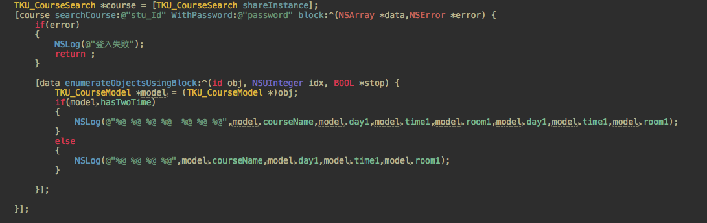
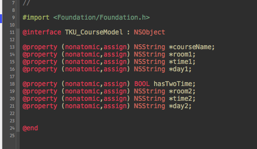

TKU_Stu_CourseSearch
====================

TKU_Stu_CourseSearch

Need <a href="https://github.com/zootreeves/Objective-C-HMTL-Parser">HTMLParser Library</a>

1:In the project settings add "/usr/include/libxml2" to the "header search paths" field   
2:Click the Frameworks group choose Add -> Existing Frameworks and from the list choose libxml2.dylib

    TKU_CourseSearch *course = [TKU_CourseSearch shareInstance];
    [course searchCourse:@"stu_id" WithPassword:@"password" block:^(NSArray *data,NSError *error) {
        if(error)
        {
            NSLog(@"登入失敗");
            return ;
        }
        
       [data enumerateObjectsUsingBlock:^(id obj, NSUInteger idx, BOOL *stop) {
            TKU_CourseModel *model = (TKU_CourseModel *)obj;
            if(model.hasTwoTime)
            {
                NSLog(@"%@ %@ %@ %@  %@ %@ %@",model.courseName,model.day1,model.time1,model.room1,model.day1,model.time1,model.room1);
            }
            else
            {
                NSLog(@"%@ %@ %@ %@",model.courseName,model.day1,model.time1,model.room1);
            }
            
        }];

    }];

---