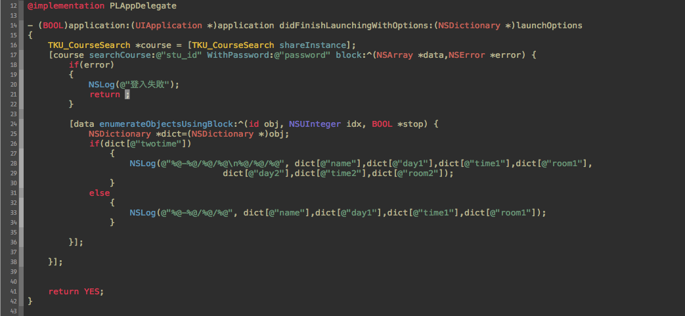

TKU_Stu_CourseSearch
====================

TKU_Stu_CourseSearch

    TKU_CourseSearch *course = [TKU_CourseSearch shareInstance];
    [course searchCourse:@"stu_id" WithPassword:@"password" block:^(NSArray *data,NSError *error) {
        if(error)
        {
            NSLog(@"登入失敗");
            return ;
        }
        
        [data enumerateObjectsUsingBlock:^(id obj, NSUInteger idx, BOOL *stop) {
            NSDictionary *dict=(NSDictionary *)obj;
            if(dict[@"twotime"])
             {   
                NSLog(@"%@-%@/%@/%@\n%@/%@/%@",
                dict[@"name"],dict[@"day1"]				   	,dict[@"time1"],dict[@"room1"],dict[@"day2"],                				dict[@"time2"],dict[@"room2"]);
            }
            else
                {
                    NSLog(@"%@-%@/%@/%@",dict[@"name"],dict[@"day1"],dict[@"time1"],dict[@"room1"]);
                }
            
        }];

    }];

---